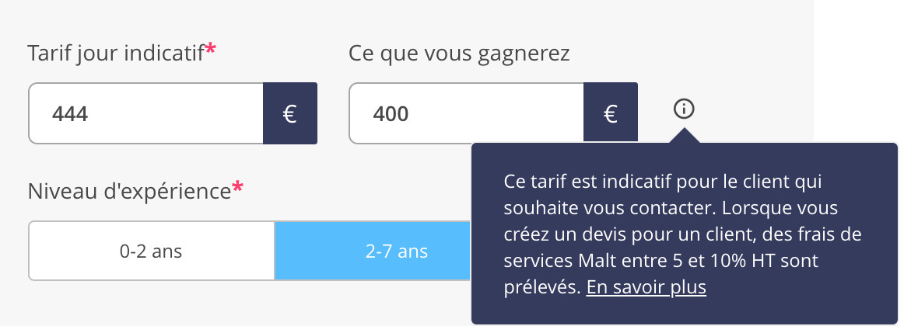

Si vous flirtez régulièrement avec la limite des 70 000 euros de chiffre d’affaire annuel qui est imposé à tous les autoentrepreneurs, gare à Malt !

Plutôt adepte de cette plateforme, je me suis récemment rendu compte que travailler uniquement avec cet intermédiaire pourrait impacter mon chiffre d’affaire jusqu’à 7000 euros par an dans le cas le plus extrême… Soit 580 euros en moins de chiffre d’affaire, chaque mois.

## Comment ça se fait ?

C'est tout bête : Malt prends 10% de vos revenus. Cette commission est appliquée par Malt pour tous les nouveaux clients [trouvés via la plateforme](https://help.malt.com/l/fr/article/dqiw8u82p2-y-a-t-il-une-commission-prelevee-par-malt).
Jusque là, rien d'anormal : c'est beaucoup moins que [les 15 à 18%](https://www.horizons-decisionnels.fr/Recrutement-de-developpeurs-informatiques-Talent-io-leve-2-M_a250.html) de commission que prend Talent, et le même pourcentage que [Comet](https://rmsnews.com/comet-freelances) et de nombreuses sociétés de placement similaires qui facturent entre 5 et 15% du tarif journalier des freelances.
 
## Alors quel est le problème ?

Le soucis avec Malt, c'est la façon dont cette commission vous est prélevée. Au lieu de facturer le client et ensuite de vous demander une facture, Malt vous demande un [mandat de facturation](https://help.malt.com/l/fr/article/n6typqae3a-est-ce-une-facture-de-malt-ou-du-freelance) et facture le client en votre nom. Qu'est-ce que ça change ? Imaginons que vous avez travaillé 5 jours et que votre TJM est de 400 euros.

Dans le cas où vous passez par un intermédiaire classique, la facturation se passe généralement de la façon suivante :

1. Le client final confirme auprès de l'intermédiaire le nombre de jours que vous avez travaillé. ***(5 jours)***

2. L'intémédiaire lui facture votre TJM en ajoutant sa commission de 10%, soit `(400 * 5 jours) + 10% = ` ***2200 euros***

3. Vous faites une facture à l'intermédiaire de votre TJM * 5. Après cela, votre chiffre d'affaire est donc de ***2000 euros*** et votre bénéfice de ***2000 euros*** ! *(je ne prends pas en compte les charges)*

Mais avec Malt, c'est une autre histoire ! Le TJM que vous mettez sur la plateforme est le montant final que paiera le prestataire *après commission*. Pour avoir un TJM de 400 euros, vous allez donc devoir afficher 444 euros sur le site.

La facturation se passera ensuite ainsi :

1. Le client final confirme auprès de Malt le nombre de jours que vous avez travaillé. ***(5 jours)***

2. Malt facture en votre nom le TJM affiché sur le site (*444 euros*) soit `(444 * 5 jours) = ` ***2220 euros***

3. Malt vous envoie une facture de ***220 euros***.

4. Votre chiffre d'affaire est donc de ***2220 euros*** et votre bénéfice... de ***2000 euros***.

En théorie, ça ne change pas grand chose : dans les deux cas, vous avez récupéré 2000 euros. Mais lorsque vous êtes sous le statut autoentrepreneur, vous ne pouvez pas dépasser le plafond de *chiffre d'affaire* déterminé par l'état. Et dans le cas de la prestation de service, le plafond est de 70 000 euros.

Passer par Malt va donc vous propulser plus rapidement vers le plafond, pour au final avoir **un bénéfice inférieur à celui que vous auriez eu en passant par un autre intermédiaire**.

## Conclusion

Bien qu'alarmiste, cet article ne s'applique qu'à une petite partie de la population de Malt, ou même des freelances en général. Une majorité des freelances n'atteignent pas le plafond, et ceux qui l'approchent passent généralement en SASU, EURL ou autre joyeuseté.

Mais j'espère qu'il aidera ceux qui connaissent les bénéfices du statut autoentrepreneur à éviter ce petit piège pas si évident à première vue !